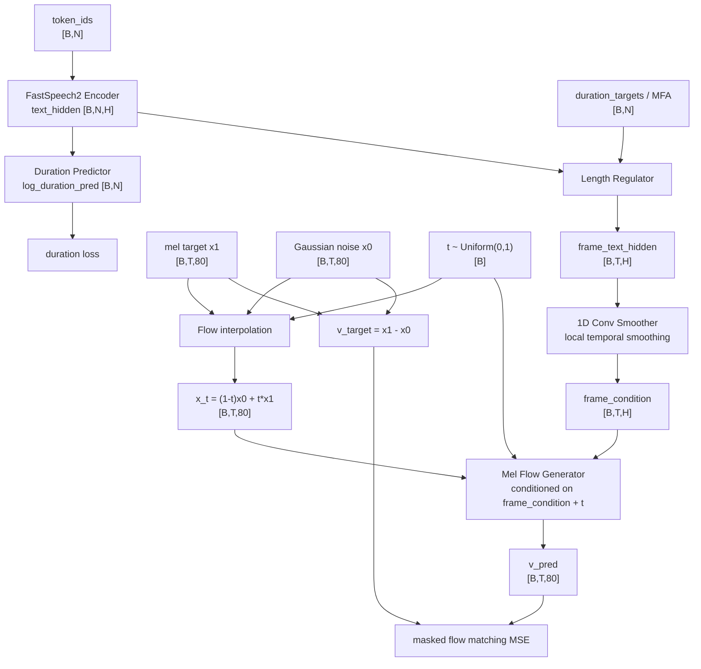

# No-StyleCode Flow-Matching Mel Baseline Design

## Goal

Create an experiment branch for a no-stylecode flow-matching mel-spectrogram baseline.

The branch replaces the FastSpeech2 decoder/postnet mel regression path with a frame-level flow-matching mel generator conditioned only on text-derived frame features. The stylecode branch is disabled for this baseline.

## Branch

```text
exp/no-stylecode-flow-mel-baseline
```

## High-level architecture

Training path:

```text
token_ids
-> FastSpeech2 encoder
-> duration predictor
-> length regulator using MFA/duration targets
-> frame-level text features
-> 1D convolution smoother
-> frame-level condition
-> flow-matching mel generator
-> velocity prediction loss against ground-truth mel
```

The baseline does not use:

```text
mel target -> style extractor -> stylecode -> style decoder -> text_hidden + style_phoneme
```

The existing style extractor files can remain in the repository, but `FastSpeech2.forward()` will not call the style extractor in this branch.

## Tensor shapes

```text
B = batch size
N = phoneme/token length
T = mel frame length
H = model hidden size, usually 256
M = mel bins, usually 80

tokens                [B, N]
src_lens              [B]
duration_targets      [B, N]
mel_targets           [B, T, 80]
mel_lens              [B]
text_hidden           [B, N, H]
frame_text_hidden     [B, T, H]
frame_condition       [B, T, H]
x0                    [B, T, 80]
x1                    [B, T, 80]
x_t                   [B, T, 80]
t                     [B]
v_target              [B, T, 80]
v_pred                [B, T, 80]
```

## Data flow



## Module design

### FrameConditionSmoother

Purpose: turn length-regulated text features into a smoother frame-level condition.

Reason: the length regulator repeats the same phoneme hidden state over all frames assigned to that phoneme. This creates step-like frame features. A shallow 1D convolutional smoother gives the flow model local temporal context around phoneme boundaries.

Recommended structure:

```text
input frame_text_hidden [B,T,H]
-> Conv1d(H -> H, kernel_size=5, padding=2)
-> GELU
-> Dropout
-> Conv1d(H -> H, kernel_size=5, padding=2)
-> GELU
-> Dropout
-> residual add
-> LayerNorm
output frame_condition [B,T,H]
```

Padding frames should be masked back to zero after smoothing.

### MelFlowGenerator

Purpose: predict the flow velocity field for mel spectrogram generation.

Inputs:

```text
x_t             [B,T,80]
t               [B]
frame_condition [B,T,H]
mel_mask        [B,T], True means padding
```

Output:

```text
v_pred          [B,T,80]
```

Recommended structure:

```text
x_t
-> Linear(80 -> H)
-> add sinusoidal frame positional encoding
-> repeated MelFlowBlock layers
-> Linear(H -> 80)
```

Each `MelFlowBlock`:

```text
1. AdaLayerNorm(time) + self-attention over mel frames
2. cross-attention: query=noisy mel hidden, key/value=frame_condition
3. AdaLayerNorm(time) + feed-forward network
4. mask padded positions to zero
```

This is a sequence DiT-style mel generator. It differs from image DiT because the sequence dimension is time frames rather than image patches, and the channel target is the mel-bin vector rather than RGB patch pixels.

## Flow-matching objective

For each batch:

```text
x1 = mel_targets
x0 = Gaussian noise sampled with the same shape as x1
t  = Uniform(0, 1)

x_t = (1 - t) * x0 + t * x1
v_target = x1 - x0
v_pred = MelFlowGenerator(x_t, t, frame_condition)
```

Loss:

```text
flow_mel_loss = masked_mse(v_pred, v_target, valid_mel_frames)
duration_loss = mse(log_duration_predictions, log1p(duration_targets)) over valid source positions

total_loss = flow_mel_weight * flow_mel_loss + duration_weight * duration_loss
```

The baseline does not use direct mel L1/MSE reconstruction loss, postnet loss, phoneme adversarial loss, or VQ loss.

## Classifier-free guidance

The design explicitly supports classifier-free guidance (CFG).

Here, the condition is the frame-level text condition:

```text
condition = frame_condition
uncondition = learned null frame condition
```

### Training CFG

Training uses condition dropout. For each sample, with probability `condition_dropout`, replace the frame-level condition with a learned null condition.

```text
keep condition: frame_condition [B,T,H]
drop condition: learned_null_condition expanded to [B,T,H]
```

This teaches the same flow generator both conditional and unconditional velocity fields.

Recommended default:

```yaml
mel_flow:
  cfg:
    enabled: true
    condition_dropout: 0.1
    null_condition: learned
    guidance_scale: 1.5
```

### Inference CFG

At each Euler step:

```text
v_uncond = f(z_t, t, null_condition)
v_cond   = f(z_t, t, frame_condition)
v_cfg    = v_uncond + guidance_scale * (v_cond - v_uncond)
z_next   = z_t + dt * v_cfg
```

When `guidance_scale = 1.0`, the update is equivalent to the conditional model. Values above 1.0 make the generated mel more strongly follow the text/duration condition.

Recommended evaluation sweep:

```text
guidance_scale = 1.0, 1.5, 2.0, 3.0
```

Listen for pronunciation stability, duration alignment, naturalness, over-conditioning artifacts, and noise.

## Training behavior

Training uses ground-truth MFA/duration targets for the length regulator so that the frame condition length matches the mel target length.

The duration predictor is still trained because inference needs predicted durations.

No stylecode is extracted during training in this branch. Checkpoint-time stylecode dumping should be disabled or bypassed for this branch.

## Inference behavior

Inference uses the duration predictor to estimate durations:

```text
text -> encoder -> duration predictor -> rounded durations -> length regulator
```

Then:

```text
z0 ~ Gaussian noise [B,T_pred,80]
for t from 0 to 1:
    v = CFG-combined velocity
    z = z + dt * v
mel = z
```

The generated mel can be passed to the existing vocoder path.

## Config additions

Recommended `model.yaml` block:

```yaml
mel_flow:
  enabled: true
  hidden_dim: 256
  depth: 6
  num_heads: 4
  dropout: 0.1
  conv_smoother_layers: 2
  conv_smoother_kernel_size: 5
  time_embed_dim: 256
  noise_scale: 1.0
  prediction_type: velocity
  cfg:
    enabled: true
    condition_dropout: 0.1
    null_condition: learned
    guidance_scale: 1.5

loss:
  duration_weight: 1.0
  flow_mel_weight: 1.0
```

Recommended `train.yaml` addition:

```yaml
mel_flow:
  sample_steps: 32
```

## File changes

Add:

```text
FastSpeech2/model/mel_flow.py
```

This file should contain:

```text
SinusoidalTimeEmbedding
AdaLayerNorm
FrameConditionSmoother
MelFlowBlock
MelFlowGenerator
masked flow matching helper
Euler sampler helper with CFG
```

Modify:

```text
FastSpeech2/model/fastspeech2.py
FastSpeech2/model/loss.py
FastSpeech2/train.py
FastSpeech2/evaluate.py
FastSpeech2/utils/tools.py
FastSpeech2/synthesize.py
FastSpeech2/config/*/model.yaml
FastSpeech2/config/*/train.yaml
```

## Implementation boundaries

This branch intentionally uses replacement rather than fallback:

```text
original decoder/postnet path is not used in this experiment branch
```

The style extractor code can remain on disk, but the model forward path does not call it.

The initial implementation should support teacher-duration training first. Inference can use predicted durations after the training path and sampler are verified.

## Verification plan

Static check:

```bash
conda run -n torch_gpu python -m py_compile \
  FastSpeech2/model/*.py \
  FastSpeech2/train.py \
  FastSpeech2/evaluate.py \
  FastSpeech2/synthesize.py \
  FastSpeech2/utils/*.py
```

Shape smoke test should verify:

```text
1. tokens [B,N], durations [B,N], mels [B,T,80] run through forward
2. v_pred shape is [B,T,80]
3. flow loss is finite
4. duration loss is finite
5. one backward step is finite
6. Euler sampler returns [B,T,80]
7. CFG guidance_scale=1.0 equals conditional path behavior
8. padded mel frames are masked out of loss
```

Full training will be run on the remote server.
